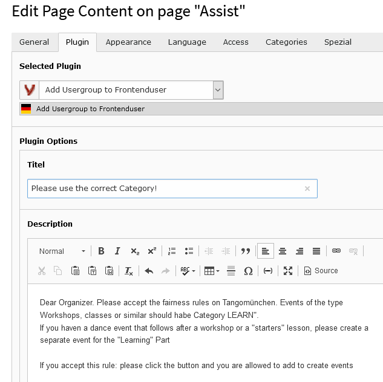
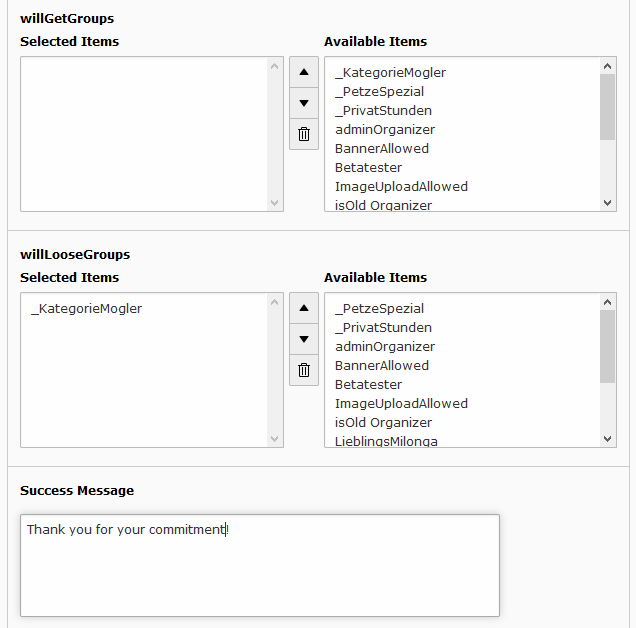

.. ==================================================
.. FOR YOUR INFORMATION
.. --------------------------------------------------
.. -*- coding: utf-8 -*- with BOM.

.. include:: Includes.txt

.. _start:

============
Introduction
============

Add the Plugin to any Page and Define headline and Text to Show

Restrictions
""""""""""""
Define the needed Usergroup(s) that ruels, when to Show the Text.
If you use "MAY not have group", please default TYPO3 Access -> "Show on any login"

Set Result
""""""""""

Result in Frontend will be a bootstrap alert div with alert-warning class.
Only visible in this example if user has usergroup "_KategoryMogler"

if he accepts the Message, he will loose usergroup "_KategoryMogler"

